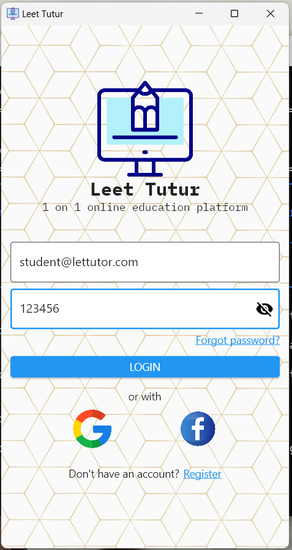
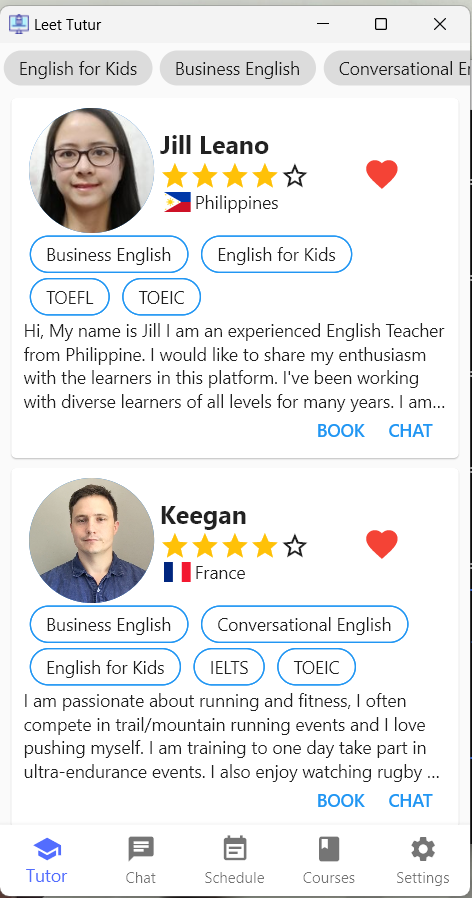
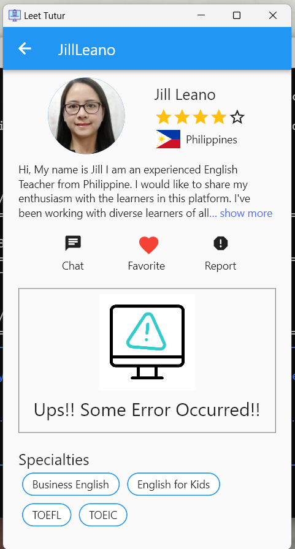
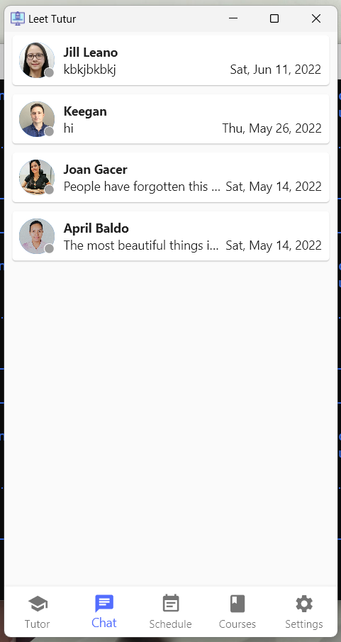
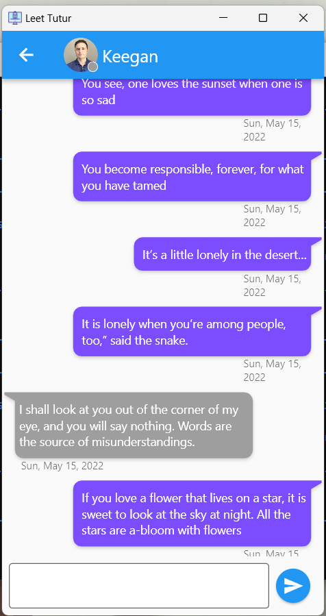
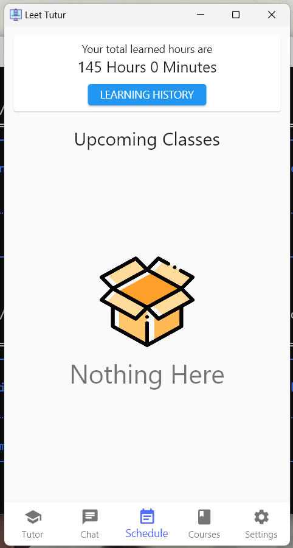
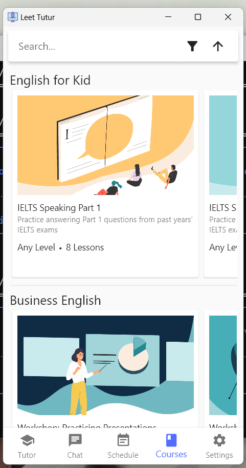
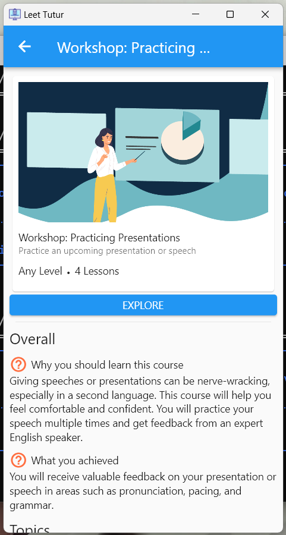
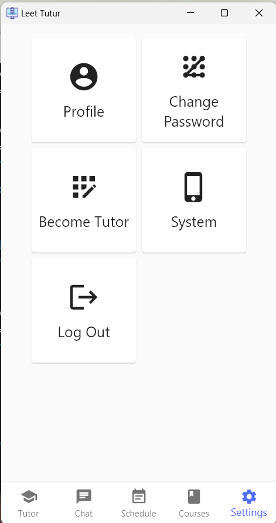

# Let Tutor

This an e-learning app written with Flutter that helps learners and tutors find each others.

## Demo Videos

Milestone 1: Mock-up UI (https://www.youtube.com/watch?v=L7tHu1RZKkk)

Milestone 2: Offline app (https://youtu.be/A2anHbUmcDA)

Milestone 3: API Integration (https://youtu.be/jIL6itSr5Y0)

# Project Report

## Author

Name: Đinh Hoàng Dương

Student ID: 18127084

Class: 18KTPM

## Overview

## Screenshots

